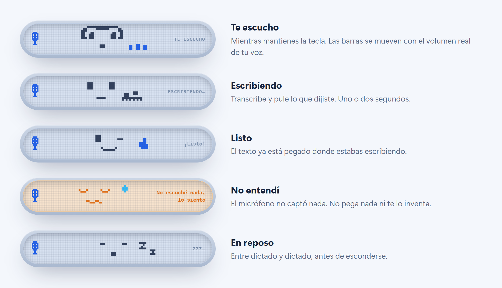
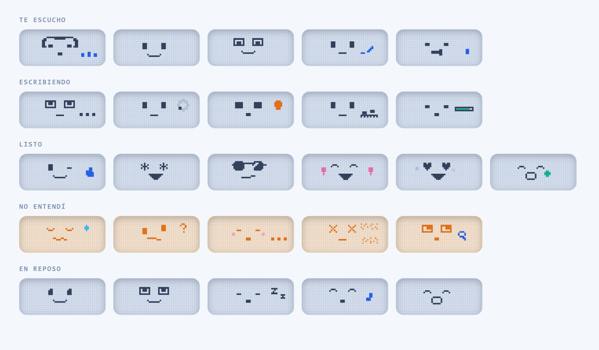

<div align="center">


## [⬇ Descargar para Windows](https://github.com/luisgs096/dicho/releases/latest/download/Dicho-setup.exe)

Gratis · sin cuenta · funciona sin internet

</div>

---

**Dicho y hecho.** Mantienes una tecla, hablas, la sueltas — y lo que dijiste aparece
escrito donde tuvieras el cursor: en WhatsApp, en el buscador, en un correo, en el chat
del trabajo. No hay que abrir ninguna ventana, ni copiar, ni pegar.

Está hecho sobre todo para quien mezcla español e inglés en la misma frase, que es donde
los dictados de siempre se rinden y te traducen media frase sin permiso.

## Instalar

1. Pulsa el botón de arriba: baja `Dicho-setup.exe`, que siempre es la última versión.
   (En [la página de versiones](https://github.com/luisgs096/dicho/releases) están todas,
   con lo que cambió en cada una.)
2. Ábrelo. Windows va a decir que **"protegió tu PC"**: es porque la app no lleva un
   certificado de firma, que cuesta unos cientos de euros al año. Pulsa
   **Más información** → **Ejecutar de todas formas**.
3. Ya está. Se instala sin preguntar nada y se abre sola.

La primera vez que dictes se descarga el motor de voz (unos 670 MB). Eso pasa una sola vez
y después funciona sin internet.

> Sólo Windows 10 y 11 de 64 bits (Intel o AMD). No hay versión para Mac, Linux ni para los
> portátiles Windows con procesador ARM.

## Cómo se usa

1. Mantén pulsado **Ctrl izquierdo + la tecla Windows**.
2. Habla.
3. Suelta.

El texto aparece solo, ya con sus mayúsculas y sus comas, donde estuvieras escribiendo. El
atajo se puede cambiar por el que quieras desde Ajustes.

Mientras tanto, una cápsula flotante te va diciendo en qué anda:



Puedes arrastrarla con el ratón hasta donde no te estorbe, y cada pantalla recuerda su
propio rincón. Si prefieres algo más sobrio, en Ajustes hay un estilo clásico de barras.

### Las 26 caritas

Cinco por estado, elegidas al azar en cada dictado, más una que sólo sale si antes te tocó
la que se come tu voz. Dos de ellas se mueven con el volumen real del micrófono.



## Preguntas frecuentes

**¿Cuesta algo?**
No, ni la app ni el motor de voz. No pide cuenta, ni correo, ni tarjeta.

**¿Necesita internet?**
Sólo para descargar el motor la primera vez y para actualizarse. Dictar funciona sin
conexión, porque la transcripción ocurre dentro de tu PC.

**¿Mi voz se manda a algún sitio?**
Tal como viene instalado, no: el audio no sale del equipo y se borra al terminar. Si en
Ajustes eliges el motor de Groq (opcional, más preciso con el spanglish), cada trozo de
audio viaja a los servidores de Groq para transcribirse y nada más. Dicho no tiene
servidores propios ni recoge estadísticas de nadie.

**¿Qué idiomas entiende?**
Español e inglés — y sobre todo la mezcla de los dos. Trae encendido un interruptor
**"No traducir nunca"** para que meter dos palabras en inglés no te voltee la frase entera
al inglés, que es el vicio clásico de estos modelos.

**¿Cuánto puedo hablar seguido?**
Hasta diez minutos del tirón. Va transcribiendo mientras hablas, así que un dictado largo
aparece casi tan rápido como uno corto: medido, 45 segundos de audio salieron 2 segundos
después de soltar la tecla.

**¿Y si no me entendió?**
Si el micrófono no captó nada, la cápsula se pone naranja y lo dice. No pega nada ni se
inventa lo que no oyó.

**¿Se actualiza sola?**
Sí. Cada vez que abres Ajustes mira si hay versión nueva; si la hay, la descarga, la
instala y se vuelve a abrir en unos segundos. No hay que volver a pasar por aquí.

**¿Dónde quedan mis dictados?**
En tu equipo y en ningún otro sitio, en `%APPDATA%\dev.mike.app`. Desde la ventana de
Historial puedes buscarlos y ver qué corrigió en cada uno.

**¿Cómo lo desinstalo?**
Configuración de Windows → Aplicaciones → Dicho → Desinstalar. Se instala sólo para tu
usuario, así que nunca pide permisos de administrador.

## Lo que trae además

- **Diccionario propio.** Las palabras que siempre se le escapan —nombres, marcas, jerga
  del trabajo— se apuntan una vez y las corrige solo a partir de ahí.
- **Historial.** Todo lo que has dictado, con las correcciones que aplicó en cada caso.
- **Arranque con Windows**, opcional, en Ajustes.
- **Sincronización con Google Drive** del diccionario y el historial entre tus equipos.
  Está hecha pero todavía sin probar de punta a punta: tómala como experimental.

---

## Para desarrolladores

App [Tauri 2](https://tauri.app) + React 19 + Tailwind 4 para Windows. Codename del repo:
`mike`. Es un clon local y gratuito de Wispr Flow.

**El recorrido de un dictado:**

1. Un hook global de teclado (`rdev`) detecta el atajo push-to-talk.
2. Se graba el micrófono (`cpal`) y se remuestrea a 16 kHz (`rubato`) **mientras hablas**:
   cada pausa cierra un trozo de 20-55 s que se manda a transcribir al vuelo, así que al
   soltar la tecla sólo queda pendiente el último. Tope de 10 minutos, con una cinta de
   capacidad en el HUD; al llegar se detiene solo y transcribe lo dicho en vez de tirarlo.
   Motores:
   - **Local**: Parakeet V3 vía `transcribe-rs`/ONNX. Se carga a RAM al empezar a dictar y
     se libera a los 10 s de inactividad (~670 MB sólo mientras se usa).
   - **Cloud (opcional)**: Groq Whisper large-v3 con API key gratuita; mejor spanglish.
3. Limpieza del texto: reglas locales (muletillas, diccionario, puntuación) o LLM vía Groq,
   que trocea por bloques los dictados largos y descarta el pulido si sale truncado. Se
   inyecta con `enigo` en la app activa.
4. Todo queda en SQLite con las correcciones que aplicó el diccionario.

**Spanglish sin traducciones.** Los modelos de voz fijan un solo idioma por cada tramo de
30 s y traducen a él lo que venga en otro. Con "No traducir nunca" Dicho no le fija idioma
al motor, le pasa una muestra real de spanglish como contexto de estilo y corta el audio en
las pausas para que cada tramo decida por su cuenta.

**El HUD** es una cápsula flotante estilo tamagotchi: pantalla LCD con rejilla de píxeles,
micrófono pixel-art y 26 animaciones repartidas en cinco estados. Se coloca en el monitor
de la ventana activa, se puede arrastrar, y guarda una posición por pantalla. El botón
**Ver animaciones** de Ajustes abre el catálogo completo, que se genera del mismo
`faces.ts` que usa la app.

Las imágenes de este README salen de ese mismo archivo, así que enseñan exactamente lo que
verá el usuario: se regeneran con
[`docs/generar-imagenes.md`](docs/generar-imagenes.md).

```sh
npm install
npm run tauri dev      # desarrollo (cierra antes la app instalada: instancia única)
npm run tauri build    # release + instalador NSIS en src-tauri/target/release/bundle/nsis/
```

Los builds debug muestran consola y usan el dev server de Vite; el autostart de Windows
sólo se gestiona desde builds release (guard en `commands.rs`). Para publicar una versión
firmada: `.\publicar.ps1 -Version X.Y.Z -Notas "…"`.
